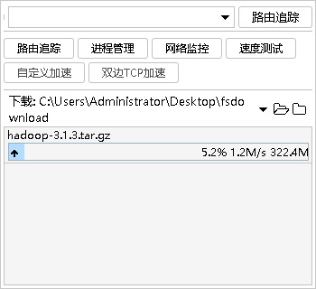
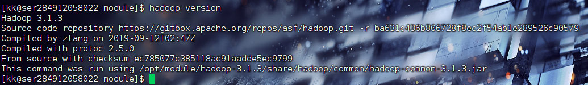

# 在CentOS下安装Hadoop

# #在安装Hadoop之前需要先安装JDK

[1.在CentOS下安装JDK1.8](在CentOS下安装JDK1.8.md) 

## 1.下载Hadoop压缩包

> 镜像下载地址：
> 

[https://mirrors.tuna.tsinghua.edu.cn/apache/hadoop/common/](https://mirrors.tuna.tsinghua.edu.cn/apache/hadoop/common/)

挑选一个版本进行下载

## 2.将下载好的Hadoop压缩包上传到CentOS上



## 3.上传后解压缩至 /opt/module 目录下

```bash
sudo tar -zxvf hadoop-3.1.3.tar.gz -C /opt/module/
```

## 4.解压完成之后配置环境变量

> 需要配置**bin**目录以及**sbin**目录
> 

### 使用Shell脚本配置Hadoop环境变量

```bash
 sudo vim /etc/profile.d/my_env.sh 
```

> 编写Shell脚本
> 

```bash
#JAVA_HOME
export JAVA_HOME=/opt/module/jdk1.8.0_212
#HADOOP_HOME
export HADOOP_HOME=//opt/module/hadoop-3.1.3
#将JAVA_HOME添加到环境变量中
export PATH=$PATH:$JAVA_HOME/bin:$HADOOP_HOME/bin:$HADOOP_HOME/sbin
```

## 5.刷新环境变量

> 1.断开连接并重新连接之后自动刷新
> 

> 2.使用**source**命令进行刷新
> 

```bash
source /etc/profile
```

## 6.使用Hadoop version命令判断是否配置成功



## 7.**完成**