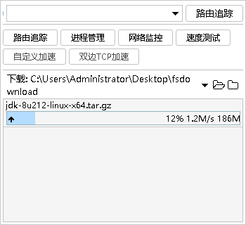
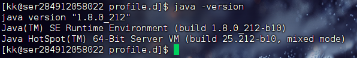

# 在CentOS下安装JDK1.8

[创建Hadoop学习途中使用的用户并设置文件夹归属](创建Hadoop学习途中使用的用户并设置文件夹归属.md) 

## 1.在/opt下创建文件夹存放压缩包

```bash
mkdir /opt/software
```


## 2.在/opt 下创建module文件夹存放解压后的文件

```bash
mkdir /opt/module
```


## 3.下载压缩包

### jdk1.8下载链接:

[https://repo.huaweicloud.com/java/jdk/8u202-b08/jdk-8u202-linux-x64.tar.gz](https://repo.huaweicloud.com/java/jdk/8u202-b08/jdk-8u202-linux-x64.tar.gz)

## 4.将下载好的压缩包上传至CentOS上



## 5.进入/opt/software文件夹下执行解压缩命令并解压到 /opt/module 文件夹下

```bash
cd /opt/software
tar -zxvf jdk-8u212-linux-x64.tar.gz -C /opt/module
```

## 6.使用shell脚本配置Java环境变量

> 进入存放shell脚本文件夹中
> 

```bash
cd /etc/profile.d/
```

> 创建配置环境变量的shell脚本
> 

```bash
 sudo touch my_env.sh
```

> 编辑脚本
> 

```bash
sudo vim ./my_env.sh
```

> 在shell脚本中添加如下内容之后按 **esc wq写入并退出**
> 

```bash
#JAVA_HOME
export JAVA_HOME=/opt/module/jdk1.8.0_212
#将JAVA_HOME添加到环境变量中
export PATH=$PATH:$JAVA_HOME/bin
```

## 7.刷新环境变量

> 1.断开连接再重新连接
> 

> 2.使用 **source 命令 (因为该命令与shell脚本为同一个shell) ==⇒ 执行该命令几次环境变量就追加几次 断开连接之后会恢复**
> 

```bash
 source /etc/profile
```

> 尝试输入 java -version命令 检查环境变量是否配置成功 **如下则配置成功**
> 

